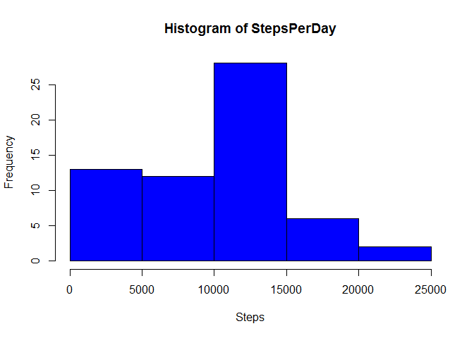
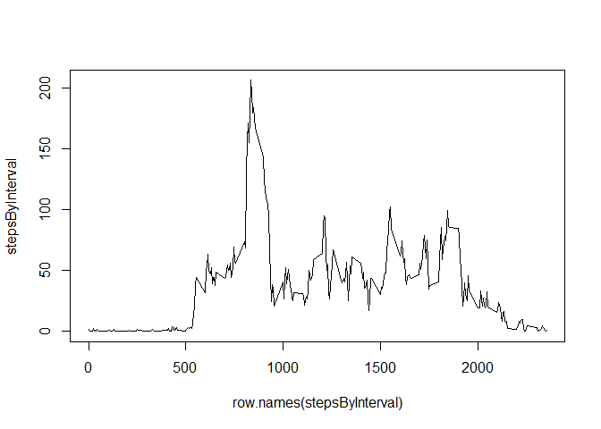
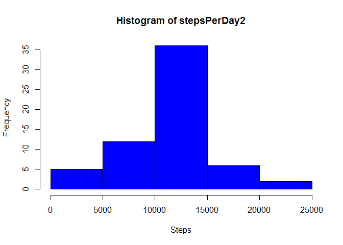
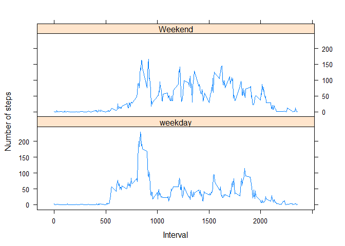

# Reproducible Research: Peer Assessment 1


## Loading and preprocessing the data
Below is how I loaded and processed the data.  Note that I made sure to reformat the date column in preparation for the assignment.


```r
fileurl <- "https://d396qusza40orc.cloudfront.net/repdata%2Fdata%2Factivity.zip"
temp <- tempfile()
download.file(fileurl,temp)
data <- read.csv(unz(temp, "activity.csv"))
unlink(temp)
data$date <- as.POSIXct(data$date, format="%Y-%m-%d")
library(lattice)
```


## What is mean total number of steps taken per day?
Code to find the average steps per day and a histogram of it.


```r
StepsPerDay <- tapply(data$steps, data$date, sum, na.rm=TRUE)
hist(StepsPerDay, ylab="Frequency", xlab="Steps", col="blue")
```

 

Mean and median for the steps per day.


```r
mean(StepsPerDay)
```

```
## [1] 9354.23
```

```r
median(StepsPerDay)
```

```
## [1] 10395
```

## What is the average daily activity pattern?
Code to get the average steps by interval and a time series plot


```r
stepsByInterval <- tapply(data$steps, data$interval, mean, na.rm=TRUE)
plot(row.names(stepsByInterval), stepsByInterval, type = "l")
```

 

Below is the interval that contains the maximum number of steps (the 104 designates the index of the interval 835)


```r
which.max(stepsByInterval)
```

```
## 835 
## 104
```

## Imputing missing values

Code to replace the missing values using a for loop, a data frame, "AverageSteps" (which is just stepsByInterval but not a table), and a numeric vector, "fill". The NA values are replaced by their corresponding 5 minute interval average.


```r
AverageSteps <- aggregate(steps ~ interval, data = data, FUN = mean)
fill <- numeric()
for (i in 1:nrow(data)) {
  entries <- data[i, ]
  if (is.na(entries$steps)) {
    steps <- subset(AverageSteps, interval == entries$interval)$steps
  } else {
    steps <- entries$steps
  }
  fill <- c(fill, steps)
}
data2 <- data
data2$steps <- fill
```


Code for the average steps per day with missing values imputed.  


```r
stepsPerDay2 <- tapply(data2$steps, data2$date, sum, na.rm=TRUE)
hist(stepsPerDay2, ylab="Frequency", xlab="Steps", col="blue")
```

 

The new mean and median.  With the replacement of the NA values, the mean and the median have risen considerably.

```r
mean(stepsPerDay2)
```

```
## [1] 10766.19
```

```r
median(stepsPerDay2)
```

```
## [1] 10766.19
```

## Are there differences in activity patterns between weekdays and weekends?

Below creates a new column for days and another for day type (weekdays or weekends)

```r
data2$days <- weekdays(data2$date)
for (i in 1:nrow(data2)) {
  if (data2[i,4]=="Sunday"|data2[i,4]=="Saturday") {
    data2$daytype[i] <- "Weekend"
  } 
  else {
    data2$daytype[i] <- "weekday"
  }
}
```


Below is the code for the steps of  the 5-minute interval and the average number of steps taken, averaged across all weekday days or weekend days.  Note that, on average, more steps are taken on weekends. 

```r
averagedActivity <- aggregate(steps ~ interval + daytype, data=data2, mean)
xyplot(steps ~ interval | daytype, averagedActivity, type = "l", layout = c(1, 2), xlab = "Interval", ylab = "Number of steps")
```

 

